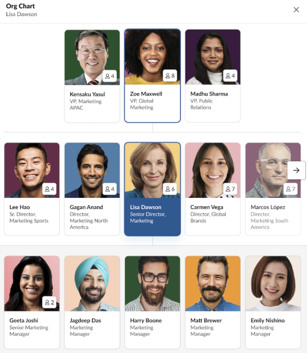

  <h2 style="margin-bottom: 25px; color: #8E44AD;">💬 Slack 자주 묻는 질문</h2>
  

    <h3 style="font-size: 16px; color: #616061; margin-bottom: 10px; border-bottom: 1px solid #e1e4e8; padding-bottom: 5px;">📁 채널 관리</h3>
    

      

        비공개 채널을 관리하는 방법
        더보기 ▼
      

      

        📌 채널 리스트에 비공개 채널이 안보이시나요? 
          &nbsp;&nbsp;&nbsp;&nbsp;&nbsp;- 비공개 채널을 관리하기 위해서는 <Strong>데이터 내보내기 요청 후 승인</Strong>을 받아야 합니다. 
          &nbsp;&nbsp;&nbsp;&nbsp;&nbsp;- 데이터 내보내기 활성화 사전신청 -> 내부 심사 및 활성화 승인 -> 채널리스트에 비공개 채널 표시 
         
          <Strong>참고💡 비공개 채널 관리 도구는 한 번 승인되면 계속 접근 가능</Strong> 
         
          <Strong>[데이터 내보내기 요청]</Strong> 
          워크스페이스 소유자는 추가 내보내기 유형에 대한 액세스를 신청할 수 있습니다. 
          신청서에는 워크스페이스 주 소유자의 승인이 필요하므로, 지원 팀에서 신청서를 검토하기 전에 이메일로 연락드릴 것입니다. 
      

    
      

    

  

  <h3 style="font-size: 16px; color: #616061; margin-bottom: 10px; border-bottom: 1px solid #e1e4e8; padding-bottom: 5px;">🔐 보안 및 인증</h3>
  

    

      Google OAuth vs SAML 차이 및 권장 설정
      더보기 ▼
    

    

      

        

          <strong>[Google OAuth vs SAML 차이]</strong> 
          아래와 같이 제어가 가능하기 때문에 <Strong>SAML설정을 권장</Strong>합니다. 
        

      

      <table style="width: 70%; margin: 0 auto; border-collapse: collapse; font-size: 13px; line-height: 1.5; background-color: #ffffff;">
        <thead>
          <tr style="background: #f8f9fa;">
            <th style="padding: 12px 10px; border: 1px solid #e1e4e8; text-align: center; font-weight: 700; color: #1d1c1d;">항목</th>
            <th style="padding: 12px 10px; border: 1px solid #e1e4e8; text-align: center; font-weight: 700; color: #1d1c1d;">Google OAuth</th>
            <th style="padding: 12px 10px; border: 1px solid #e1e4e8; text-align: center; font-weight: 700; color: #1d1c1d;">Google SAML</th>
          </tr>
        </thead>
        <tbody>
          <tr>
            <td style="padding: 10px; border: 1px solid #e1e4e8; text-align: center; font-weight: 600; background-color: transparent;">설정 난이도</td>
            <td style="padding: 10px; border: 1px solid #e1e4e8; text-align: center; background-color: transparent;">쉬움 (빠른 설정)</td>
            <td style="padding: 10px; border: 1px solid #e1e4e8; text-align: center; background-color: transparent;">중간 (IDP 설정 필요)</td>
          </tr>
          <tr>
            <td style="padding: 10px; border: 1px solid #e1e4e8; text-align: center; font-weight: 600; background-color: transparent;">지원 플랜</td>
            <td style="padding: 10px; border: 1px solid #e1e4e8; text-align: center; background-color: transparent;">Pro, Business+</td>
            <td style="padding: 10px; border: 1px solid #e1e4e8; text-align: center; background-color: transparent;">Business+, Enterprise Grid</td>
          </tr>
          <tr>
            <td style="padding: 10px; border: 1px solid #e1e4e8; text-align: center; font-weight: 600; background-color: transparent;">JIT 프로비저닝 제어</td>
            <td style="padding: 10px; border: 1px solid #e1e4e8; text-align: center; background-color: transparent;">❌ 항상 ON (끌 수 없음)</td>
            <td style="padding: 10px; border: 1px solid #e1e4e8; text-align: center; background-color: transparent;">✅ ON/OFF 선택 가능</td>
          </tr>
          <tr>
            <td style="padding: 10px; border: 1px solid #e1e4e8; text-align: center; font-weight: 600; background-color: transparent;">사용자 단위 접근 제어</td>
            <td style="padding: 10px; border: 1px solid #e1e4e8; text-align: center; background-color: transparent;">❌ 도메인 단위만 가능</td>
            <td style="padding: 10px; border: 1px solid #e1e4e8; text-align: center; background-color: transparent;">✅ 사용자/그룹 단위 제어</td>
          </tr>
          <tr>
            <td style="padding: 10px; border: 1px solid #e1e4e8; text-align: center; font-weight: 600; background-color: transparent;">SCIM 연동</td>
            <td style="padding: 10px; border: 1px solid #e1e4e8; text-align: center; background-color: transparent;">❌ 불가</td>
            <td style="padding: 10px; border: 1px solid #e1e4e8; text-align: center; background-color: transparent;">✅ 가능</td>
          </tr>
          <tr>
            <td style="padding: 10px; border: 1px solid #e1e4e8; text-align: center; font-weight: 600; background-color: transparent;">2FA 적용</td>
            <td style="padding: 10px; border: 1px solid #e1e4e8; text-align: center; background-color: transparent;">IDP 레벨 설정 필요</td>
            <td style="padding: 10px; border: 1px solid #e1e4e8; text-align: center; background-color: transparent;">IDP 레벨 설정 필요</td>
          </tr>
        </tbody>
      </table>
        

          

             
            📌 참조 
                  1. <strong>JIT(Just-In-Time) 프로비저닝</strong>은 <strong>사용자가 처음 로그인할 때 자동으로 계정이 만들어지는 기능</strong>입니다. 
              &nbsp;&nbsp;&nbsp;&nbsp;&nbsp;이 기능을 끄면 관리자가 사전에 승인한 사용자만 접근할 수 있어서 보안을 강화할 수 있습니다. 
              &nbsp;&nbsp;&nbsp;&nbsp;&nbsp;참고) 필요한 경우, Feedback 팀으로 요청하여 JIT를 Off할 수 있습니다. 
              2. <strong>SCIM</strong>은 사용자 계정을 IDP(Okta, Google Workspace 등)와 Slack 사이에서 자동으로 동기화해주는 기능입니다.
          

      

      

    

  

  

    

      SCIM Provisioning 활용 방법 (프로필·유저 관리 자동화)
      더보기 ▼
    

      

        📌 <Strong>SCIM이란?</Strong> 
        &nbsp;&nbsp;&nbsp;&nbsp;&nbsp;회사의 IDP(Identity Provider, 예: Okta, Entra ID, Google)와 Slack을 연결해서 사용자 계정을 자동으로  
        &nbsp;&nbsp;&nbsp;&nbsp;&nbsp;생성·수정·비활성화할 수 있게 해주는 <Strong>ID 관리를 자동화하는 국제 표준 프로토콜</Strong>입니다. 
         
          

  ⚠️ SAML : 로그인 시 싱크 담당 
    &nbsp;&nbsp;&nbsp;&nbsp;&nbsp;SCIM : 계정 생성·수정·비활성화 등 라이프사이클 관리를 SCIM Connector 앱을 통해 별도 수행

         
        🌟 <Strong>IDP별 지원 현황</Strong> 
        &nbsp;&nbsp;&nbsp;&nbsp;&nbsp;- 설정 하면서 슬랙에 해당 IDP의 SCIM Connector 설치가 진행됨. (<Strong>Org레벨</Strong>에 설치필요)  
        &nbsp;&nbsp;&nbsp;&nbsp;&nbsp;- 만약 SCIM Connector 가 없다면 Custom SCIM Connector 제작이 필요합니다. 
<table style="width: 100%; margin: 10px 0 0 10px; border-collapse: collapse; font-size: 13px; line-height: 1.5; background-color: #ffffff;">
  <thead>
    <tr style="background: #f8f9fa;">
      <th style="padding: 12px 15px; border: 1px solid #e1e4e8; text-align: center; font-weight: 700; color: #1d1c1d; white-space: nowrap;">IDP</th>
      <th style="padding: 12px 15px; border: 1px solid #e1e4e8; text-align: center; font-weight: 700; color: #1d1c1d; white-space: nowrap;">SCIM 연동 앱</th>
      <th style="padding: 12px 15px; border: 1px solid #e1e4e8; text-align: center; font-weight: 700; color: #1d1c1d; white-space: nowrap;">비고</th>
      <th style="padding: 12px 15px; border: 1px solid #e1e4e8; text-align: center; font-weight: 700; color: #1d1c1d; white-space: nowrap;">공식 설정 문서</th>
    </tr>
  </thead>
  <tbody>
    <tr>
      <td style="padding: 10px 15px; border: 1px solid #e1e4e8; text-align: center; font-weight: 600; white-space: nowrap;">Entra ID</td>
      <td style="padding: 10px 15px; border: 1px solid #e1e4e8; text-align: center; white-space: nowrap;">Microsoft Azure AD Provisioning</td>
      <td style="padding: 10px 15px; border: 1px solid #e1e4e8; text-align: center; white-space: nowrap;">-</td>
      <td style="padding: 10px 15px; border: 1px solid #e1e4e8; text-align: center; font-weight: 600; white-space: nowrap;">
        <a href="https://learn.microsoft.com/en-us/entra/identity/saas-apps/slack-provisioning-tutorial" target="_blank" style="color: #007bff; text-decoration: none;">링크</a>
      </td>
    </tr>
    <tr>
      <td style="padding: 10px 15px; border: 1px solid #e1e4e8; text-align: center; font-weight: 600; white-space: nowrap;">Okta</td>
      <td style="padding: 10px 15px; border: 1px solid #e1e4e8; text-align: center; white-space: nowrap;">Okta Provisioning</td>
      <td style="padding: 10px 15px; border: 1px solid #e1e4e8; text-align: center; white-space: nowrap;">-</td>
      <td style="padding: 10px 15px; border: 1px solid #e1e4e8; text-align: center; white-space: nowrap;">
        <a href="https://help.okta.com/en-us/content/topics/provisioning/slack/slck-integrate-slack.htm" target="_blank" style="color: #007bff; text-decoration: none;">링크</a>
      </td>
    </tr>
    <tr>
      <td style="padding: 10px 15px; border: 1px solid #e1e4e8; text-align: center; font-weight: 600; white-space: nowrap;">Google</td>
      <td style="padding: 10px 15px; border: 1px solid #e1e4e8; text-align: center; white-space: nowrap;">제한적</td>
      <td style="padding: 10px 15px; border: 1px solid #e1e4e8; text-align: center; white-space: nowrap;">이름·이메일 등 일부 필드만, 그룹 푸시❌</td>
      <td style="padding: 10px 15px; border: 1px solid #e1e4e8; text-align: center; white-space: nowrap;">
        <a href="https://knowledge.workspace.google.com/admin/users/advanced/configure-slack-user-provisioning?sjid=17221264273189227714-AP&visit_id=639104557331627052-2063466825&rd=1&hl=ko" target="_blank" style="color: #007bff; text-decoration: none;">링크</a>
      </td>
    </tr>
  </tbody>
</table>
      

  

  

    <h3 style="font-size: 16px; color: #616061; margin-bottom: 10px; border-bottom: 1px solid #e1e4e8; padding-bottom: 5px;">📤 데이터 내보내기 및 메시지 관리</h3>
        

      

        비공개 채널/DM까지 포함하여 데이터 내보내기 방법
        더보기 ▼
      

      

        📌 <Strong>비공개 채널/DM까지 포함하여 데이터 내보내기</Strong>를 하기위해서는 아래의 절차가 필요합니다. 
          &nbsp;&nbsp;&nbsp;&nbsp;&nbsp;- 데이터 내보내기 활성화 사전신청 -> 내부 심사 및 활성화 승인 -> 데이터 내보내기 가능 
         
          <Strong>[데이터 내보내기 요청]</Strong> 
          워크스페이스 소유자는 추가 내보내기 유형에 대한 액세스를 신청할 수 있습니다. 
          신청서에는 워크스페이스 주 소유자의 승인이 필요하므로, 지원 팀에서 신청서를 검토하기 전에 이메일로 연락드릴 것입니다. 
      

    
    

    

      

        데이터 내보내기 및 가독성 있게 확인하는 방법
        더보기 ▼
      

            

        📌 <Strong>비공개 채널/DM까지 포함하여 데이터 내보내기</Strong>를 하기위해서 [<a href="https://slackforadmin.github.io/slackbizplus/#/dataexport?id=%eb%8d%b0%ec%9d%b4%ed%84%b0-%eb%82%b4%eb%b3%b4%eb%82%b4%ea%b8%b0-%ec%9a%94%ec%b2%ad" target="_blank" rel="noopener" style="color: #1264a3; text-decoration: underline; font-size: 15px; font-weight: 600;"> 데이터 내보내기 요청 </a>]🔼이 필요합니다.
      

  
  

    
STEP 01

    
데이터 내보내기 설정

    

      1. 보안 > 데이터 가져오기 및 내보내기 > 내보내기 날짜 범위 선택 후 <b>[내보내기 시작]</b> 클릭
    

    
  

  

    
STEP 02

    
파일 다운로드

    

      2. 목록에서 <b>[다운로드 준비]</b> 버튼을 클릭하여 파일을 저장
    

    
  

  

    
STEP 03

    
JSON 데이터 변환

    

      3. <b>[JSON을 표로 변환하기]</b> 버튼 클릭 후 변환 도구 웹사이트 오픈 
      &nbsp;&nbsp;&nbsp;JSON 파일 업로드 또는 붙여넣기 후 결과 확인
    

  <a href="https://jsontotable.org/" target="_blank" rel="noopener" style="display: inline-block; padding: 8px 16px; background-color: #8E44AD; color: #ffffff; text-decoration: none; border-radius: 4px; font-size: 13px; font-weight: 600;margin-bottom: 10px;">
    JSON을 표로 변환하기 (JSON to Table)
  </a>
     
    

  

    ⚠️ 보안 주의사항
  

  

    기업의 민감 데이터가 포함된 경우 외부 사이트 대신 <strong>엑셀(데이터 가져오기 > JSON)</strong>이나 
    브라우저의 <strong>JSON Viewer 확장 프로그램</strong>을 사용해 로컬에서 확인하는 것을 권장합니다.
  

  

    

  

    

    <h3 style="font-size: 16px; color: #616061; margin-bottom: 10px; border-bottom: 1px solid #e1e4e8; padding-bottom: 5px;">👤 계정 및 사용자 관리</h3>
    

      

        승인 없이 다수 멤버 일괄 초대 방법
        더보기 ▼
      

  

    
STEP 01

    
이메일 도메인 설정

    

      1. 관리자 화면에서 설정 > 설정 및 권한 > <b>승인된 이메일 도메인 설정</b> 
    

    
  

  

    
STEP 02

    
사용자 초대 메뉴 이동

    

      2. 워크스페이스명 > 사용자 초대 버튼 클릭해서 <b>사용자 초대 팝업 오픈</b>
    

    
  

  

    
STEP 03

    
초대 링크 복사 및 전달

    

      3. 이메일 설정하거나 초대 링크를 복사해서 대상자들에게 전달 
      ※ 설정된 도메인 계정 사용자는 별도 승인 절차 없이 <b>즉시 입장</b>이 가능합니다.
    

    
  

    

    

      

        SSO연동 시에 사용자 이메일 변경 방법
        더보기 ▼
      

    📌 이메일이나 표시이름을 변경할 수 없으신가요? 
    &nbsp;&nbsp;&nbsp;&nbsp;&nbsp;SSO를 활성화한 경우, 이메일 주소를 포함한 <b>개인 정보 편집 기능이 제한</b>될 수 있으나, 
    &nbsp;&nbsp;&nbsp;&nbsp;&nbsp;<b>워크스페이스 소유자</b>가 사용자들이 이메일 주소를 변경할 수 있도록 허용할 수 있습니다.
         
   
        🔗 참조 링크 
        <a href="https://slack.com/intl/ko-kr/help/articles/207262907-%EC%9D%B4%EB%A9%94%EC%9D%BC-%EC%A3%BC%EC%86%8C-%EB%B3%80%EA%B2%BD?gad_source=1&gad_campaignid=23274986143&gbraid=0AAAAACylTvomOl6mvXW5Kww-Pj98WDTOo&gclid=Cj0KCQjwve7NBhC-ARIsALZy9HWion0c2Ez6xoOYmDZYm113CjSolE9b0bVu26oxttDRe9rdAcAD_1saAkk-EALw_wcB#%EB%8D%B0%EC%8A%A4%ED%81%AC%ED%86%B1-1" target="_blank" rel="noopener" style="color: #1264a3; text-decoration: underline; font-size: 15px; font-weight: 600;"> 이메일 주소 변경 </a> 
        <a href="https://slack.com/intl/ko-kr/help/articles/225531168-%EA%B5%AC%EC%84%B1%EC%9B%90%EC%9D%98-%EC%9D%B4%EB%A9%94%EC%9D%BC-%EC%A3%BC%EC%86%8C-%EB%B3%80%EA%B2%BD" target="_blank" rel="noopener" style="color: #1264a3; text-decoration: underline; font-size: 15px; font-weight: 600;"> 구성원의 이메일 주소 변경 </a> 
         
        💡 <b>이메일 주소를 변경할 수 있도록 허용하는 방법</b>
      

      
      

              📌 단, 아래 3개 항목 중 하나라도 기본값과 다르게 설정되어 있는 경우, 
        &nbsp;&nbsp;&nbsp;&nbsp;&nbsp;로그인 시, 해당 사용자의 프로필 값이 업데이트 되지 않는 다는 것 기억해주세요!! 
        &nbsp;&nbsp;&nbsp;&nbsp;&nbsp;즉, 이메일 주소를 변경할 수 있도록 설정을 변경하면 사용자 프로필 정보가 싱크되지 않습니다. 
        &nbsp;&nbsp;&nbsp;&nbsp;&nbsp;(전제 : 자동 프로비저닝을 사용하고 있지 않음) 
               
      

      
    

      

      

        [수정중]SCIM API를 활용한 Atlas 설정 방법
        더보기 ▼
      

        

          📌 SCIM API를 활용한 Atlas 설정가이드입니다. 
              &nbsp;&nbsp;&nbsp;&nbsp;&nbsp;&nbsp;&nbsp;<Strong>초기설정1,2 완료 후 사용자 업데이트</Strong> 진행해주세요. 
              &nbsp;&nbsp;&nbsp;&nbsp;&nbsp;&nbsp;&nbsp;해당 방식으로 사용자 프로필정보(SCIM API타입 항목)도 업데이트 가능합니다. 
           
          

      

        1️⃣ [초기설정1]SCIM API를 호출 하기 위한 앱 생성
      

    

    

      

        
✔️ 영상 가이드

        <video width="400" controls style="border-radius: 8px; box-shadow: 0 2px 5px rgba(0,0,0,0.06); border: 1px solid #e1e4e8; display: block;">
          <source src="https://github.com/minaslack/slackbizplus/releases/download/v1.0/Setup01_SCIMAPI.mp4" type="video/mp4">
        </video>
      

    

  

      

        1) <a href="http://api.slack.com/apps" target="_blank" rel="noopener" style="color: #1264a3; text-decoration: underline; font-size: 15px; font-weight: 600;"> api.slack.com/apps </a>으로 접속 > [Create New APP] 버튼 클릭
        

      
      

        2) From scratch 선택
      

      

        3) APP 이름을 지정하고, 워크스페이스를 선택 후 [Create App]버튼 클릭
      

      
      

        4) 사이드바의 [OAuth & Permissions]선택 > [Redirect URLs]섹션에 [Add New Redirect URL]버튼 클릭 후, [https://localhost]기입 >[ADD]버튼 클릭 > [Save URLs]버튼 클릭
      

      
 

        5) 동일 페이지 아래 [사용자 토큰 범위]섹션에 [OAuth범위 추가]버튼 클릭 후, [admin] 선택
      

      

    
    
  

 

        6) 사이드바의 [Manage Distribution]선택 > [Remove Hard Coded Information]의 [I've reviewed and removed any hard-coded information] 체크 후, 활성화된 [Activate public distribution]버튼 클릭 
    
       📌 만약 [Enable Features & Functionality], [Add OAuth Redirect URLs]가 체크되어 있지 않으면 해당 페이지 새로고침 해주세요!! 
      

      
 

        7) 사이드바의 [Basic Information]선택 > Client ID & Client Secret 복사
      

      

        

      

        2️⃣ [초기설정2]POST MAN 연동
      

            

    

      

        
✔️ 영상 가이드

        <video width="400" controls style="border-radius: 8px; box-shadow: 0 2px 5px rgba(0,0,0,0.06); border: 1px solid #e1e4e8; display: block;">
          <source src="https://github.com/minaslack/slackbizplus/releases/download/v1.0/oktavideo.mp4" type="video/mp4">
        </video>
      

      

        <a href="asset/pdf/SCIM_postman_collection.json" 
           download="SCIM_postman_collection.json" 
           target="_blank" 
           title="SCIM_postman_collection.json 다운로드" 
           style="display: inline-flex; align-items: center; justify-content: center; width: 72px; height: 72px; background-color: #f0f3f6; border: 2.5px solid #0366d6; border-radius: 50%; transition: all 0.2s ease-in-out; text-decoration: none; box-shadow: 0 4px 12px rgba(3,102,214,0.15); flex-shrink: 0;"
           onmouseover="this.style.backgroundColor='#0366d6'; this.style.transform='scale(1.1)';" 
           onmouseout="this.style.backgroundColor='#f0f3f6'; this.style.transform='scale(1)';"
           onmousedown="this.style.transform='scale(0.9)';" 
           onmouseup="this.style.transform='scale(1.1)';">
          
        </a>
        
SCIM_postman_collection.json

      

    

  

         

        📌 잠깐!! 우선 PostMan계정부터 생성해주세요!! 
            
        1) <a href="https://www.postman.com/" target="_blank" rel="noopener" style="color: #1264a3; text-decoration: underline; font-size: 15px; font-weight: 600;"> Post Man </a> 오픈 > [Import]선택 > SCIM (Shared).postman_collection.json파일 import > [SCIM]폴더 신규 추가 확인
      

        

    
    
  

        

        2) SCIM (Shared) > Authentication > Get access token에서 slack api page에서 발급받은 Client Id/Client Secret값 붙여넣고 [Save]버튼 클릭&nbsp;&nbsp;(**Client Secret는 [Show]버튼 클릭 후, 복사)
      

        

    
    
  

        

        3) Slack api page에서 [Settings] > [Manage Distribution]  > Shareable URL을 복사
      

        

        4) 복사한 URL을 크롬의 새창에서 붙여넣기
      

        

        5) 적용 워크스페이스 선택 후, [허용] 버튼 클릭
      

        
        

        6) [code=]와 사이 [&state=]사이 값을 복사
      

        

        7) SCIM (Shared) > Authentication > Get Access Token에서 code값 붙여넣고 [Save]버튼 클릭
      

        

        8) [Send]버튼 클릭 후, 아래 Body 영역에 access_token값을 복사 
      

        
          

          9) SCIM (Shared) > SCIM > Users > Edit User (PATCH) 우측에 [...] > Duplicate 클릭해서 복제
      

          

    
    
  

          

          10) SCIM (Shared) > SCIM > Users > Edit User (PATCH) Copy의 Headers > Authorization에 복사한 access_token값 붙여넣고 [Save]버튼 클릭
      

          

          11) SCIM (Shared) > SCIM > Users > Edit User (PATCH) Copy 
            &nbsp;&nbsp;&nbsp;&nbsp;&nbsp;1. URL의 Users/뒤 주소 삭제 
            &nbsp;&nbsp;&nbsp;&nbsp;&nbsp;2. Body > 아래 User Update 내용 복사&붙여넣기 
            &nbsp;&nbsp;&nbsp;&nbsp;&nbsp;3. Type을 JSON으로 설정 
            &nbsp;&nbsp;&nbsp;&nbsp;&nbsp;4. [Save]버튼 클릭 
      

          

  

    📍 User Update
  

  

{ 
    &nbsp;&nbsp;&nbsp;&nbsp;&nbsp;"schemas": [ 
        &nbsp;&nbsp;&nbsp;&nbsp;&nbsp;&nbsp;&nbsp;&nbsp;"urn:scim:schemas:core:1.0", 
        &nbsp;&nbsp;&nbsp;&nbsp;&nbsp;&nbsp;&nbsp;&nbsp;"urn:scim:schemas:extension:enterprise:1.0" 
    &nbsp;&nbsp;&nbsp;&nbsp;], 
    &nbsp;&nbsp;&nbsp;&nbsp;"id": "{{id}}", 
    &nbsp;&nbsp;&nbsp;&nbsp;"urn:scim:schemas:extension:enterprise:1.0": { 
        &nbsp;&nbsp;&nbsp;&nbsp;&nbsp;&nbsp;&nbsp;&nbsp;"manager": { 
            &nbsp;&nbsp;&nbsp;&nbsp;&nbsp;&nbsp;&nbsp;&nbsp;&nbsp;&nbsp;&nbsp;&nbsp;"managerId": "{{managerid}}" 
        &nbsp;&nbsp;&nbsp;&nbsp;&nbsp;&nbsp;&nbsp;&nbsp;} 
    &nbsp;&nbsp;&nbsp;&nbsp;} 
} 
  

          

        

      

        3️⃣ 사용자 정보 일괄 Update
      

              

    

      

        
✔️ 영상 가이드

        <video width="400" controls style="border-radius: 8px; box-shadow: 0 2px 5px rgba(0,0,0,0.06); border: 1px solid #e1e4e8; display: block;">
          <source src="https://github.com/minaslack/slackbizplus/releases/download/v1.0/oktavideo.mp4" type="video/mp4">
        </video>
      

    

  

          1) 우측 하단의 [Tools] > [Runner]선택
      

          2) 좌측 사이드바에서 [User]폴더를 드래그 앤 드롭
      

          3) [Deselect All]을 선택 후, Edit user(patch) Copy를 선택
      

      

          4) 우측 화면에서 [Select File]버튼 클릭 후, 편집한 CSV파일 선택
      

                    

                          

  

    📍 CSV 편집
  

  

&nbsp;&nbsp;&nbsp;&nbsp;아래 내용으로 맵핑해서 CSV파일 편집해주세요. 
&nbsp;&nbsp;&nbsp;&nbsp;* Id : 사용자 UserId 
&nbsp;&nbsp;&nbsp;&nbsp;* ManagerId : 해당 사용자의 관리자의 UserId 
  

      

        <a href="asset/pdf/SCIM_Update_ManagerID.csv" 
           download="SCIM_Update_ManagerID.csv" 
           target="_blank" 
           title="SCIM_Update_ManagerID.csv 다운로드" 
           style="display: inline-flex; align-items: center; justify-content: center; width: 50px; height: 50px; background-color: #f0f3f6; border: 2.5px solid #0366d6; border-radius: 50%; transition: all 0.2s ease-in-out; text-decoration: none; box-shadow: 0 4px 12px rgba(3,102,214,0.15); flex-shrink: 0;"
           onmouseover="this.style.backgroundColor='#0366d6'; this.style.transform='scale(1.1)';" 
           onmouseout="this.style.backgroundColor='#f0f3f6'; this.style.transform='scale(1)';"
           onmousedown="this.style.transform='scale(0.9)';" 
           onmouseup="this.style.transform='scale(1.1)';">
          
        </a>
        
SCIM_Update_ManagerID.csv

      
            
    

 
&nbsp;&nbsp;&nbsp;&nbsp;* UserId 확인방법 : 관리자 화면의 [사람] > [멤버]에서 각 사용자별 [멤버ID]확인

                    

          5) Preview를 통해서 정상적으로 불러오기가 되었는지 확인 후 [Upload to Workspace]버튼 클릭
      

          

          6) [Start run]버튼 클릭
      

          7) 결과 확인 (200 OK면 User Update성공!!)
      

          
        

        

    

    <h3 style="font-size: 16px; color: #616061; margin-bottom: 10px; border-bottom: 1px solid #e1e4e8; padding-bottom: 5px;">🌐 외부 협업 및 권한 설정</h3>
    

      

        Slack Connect 및 게스트 초대를 관리자 승인 하에 운영하는 방법
        더보기 ▼
      

      

        곧 업로드 예정(4월 내)
      

    

  

